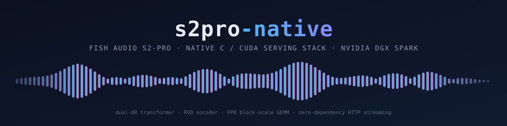

[](https://en.cppreference.com/w/c/11)
[](https://developer.nvidia.com/cuda-toolkit)
[-1f6feb?style=flat)](docs/SPARK.md)
[](LICENSE)

Native C and CUDA inference for
[Fish Audio S2-Pro](https://huggingface.co/fishaudio/s2-pro) (OpenAudio S2),
designed and qualified for NVIDIA DGX Spark.

The project turns text into progressive 44.1 kHz mono PCM. The complete
inference path—prompt preparation, the 36-layer slow-AR backbone, the
4-layer fast-AR residual decoder, the DAC vocoder, scheduling, and HTTP
delivery—runs in native C and CUDA. Python, PyTorch, SGLang, and vLLM are
not part of the runtime.

## At a glance

Measured on one DGX Spark (GB10, `sm_121`), single stream, 67-token prompt,
60 frames, sampled (temp 0.8, seed 3; details in
[Performance](#performance)):

|  | BF16 cuBLAS (default) | INT8 weight-only (`S2P_INT8=1`) |
| --- | ---: | ---: |
| Decode per frame (46.4 ms of audio) | 93.3 ms | **39.7 ms** |
| RTF (compute ÷ audio, lower is better) | 2.41 | **1.27** |
| Weight + runtime memory | ~12 GB | **~8.5 GB** |

INT8 decode is **below the 46.4 ms frame budget**: sustained generation
after prefill runs at RTF 0.86 before vocoding. End-to-end streamed serving
(bit-exact incremental DAC, pipelined and batched on its own CUDA stream,
split-K decode attention, device-side sampling, CUDA-graph replay of the
whole decode tick, packed 4-bit backbone) measures wall RTF **0.95**
zero-shot / 1.03–1.05 behind a 51 s voice reference — down from 2.05 —
with TTFA 0.18 s zero-shot / 1.58 s with the reference block; the
[roadmap](#roadmap-to-rtf--1) holds the remaining arithmetic for the
voice-referenced path.

> **Status: functional pre-release.** BF16, INT8, and the packed
> group-wise INT4 backbone pass the layer-parity gate against the PyTorch
> reference; voice cloning, the multilingual voice registry, and the HTTP
> streaming server are exercised end to end on real hardware. Zero-shot
> single-stream synthesis runs below realtime (wall RTF 0.95);
> voice-referenced serving is at 1.03–1.05. There is no published release
> line yet; deploy from a reviewed, pinned `main` commit.

## What this project provides

- Native S2-Pro Dual-AR inference with custom CUDA kernels and cuBLAS
  execution on real `sm_121` SASS.
- An FP8 block-scale GEMM path through
  [fish-scales-ops](https://github.com/fishaudio/fish-scales-ops), weights
  quantized once at load, verified numerically on this GPU (cos 0.9993 vs
  BF16).
- Incremental frame generation and streaming vocoder decode without a Python
  or framework sidecar.
- A byte-level BPE tokenizer that is bit-exact against the HF `tokenizers`
  reference on a 4,000-case fuzz, and a hand-written ChatML prompt builder
  with VQ-part injection.
- One shared engine with lockstep-batched sessions, first-frame priority,
  cancellation, and graceful shutdown.
- A multilingual named-voice registry (drop `<name>.wav` + `<name>.txt`
  into `voices/`) plus per-request cloning over HTTP
  ([docs/VOICES.md](docs/VOICES.md)). Reference audio is generated per
  deployment rather than committed — one command produces any or all 30
  multilingual voices ([`tools/voicegen`](tools/voicegen/README.md)).
- Frozen module contracts (`include/s2pro/`) that let independent
  contributors build against stable interfaces ([CONTRACT.md](CONTRACT.md)).

The project intentionally targets **S2-Pro only**. It does not include
S2.1-Pro (API-only, no public weights), S1, or any model framework in the
runtime. Voice cloning (encode + prompt injection) is active with the full
codec artifact and drives the named-voice registry.

## Supported languages and audio

S2-Pro is multilingual (80+ languages) with inline free-form `[bracket]`
prosody and emotion control; language coverage and control quality are
properties of the upstream checkpoint, not re-qualified per language here.

Audio is emitted as 44,100 Hz, mono, signed 16-bit little-endian PCM. Each
codec frame represents 2,048 samples, or ~46.4 ms; streaming delivery uses
overlapping vocoder windows with crossfade.

## Architecture

```text
HTTP client
    |
    v
native C HTTP server (validation, auth, chunked streaming, cancellation)
    |
    v
lockstep scheduler (sessions, first-frame priority, backpressure)
    |
    +--> slow-AR backbone, 36L d2560 GQA 32/8 + qk-norm (CUDA/cuBLAS/FP8)
    |          |
    |          `-- one semantic token per frame (two-softmax sampling)
    |
    +--> fast-AR residual decoder, 4L (9 greedy codebook steps per frame)
    |          |
    |          `-- 10 RVQ codes per frame
    |
    `--> DAC / Firefly-GAN vocoder (CUDA)
               |
               `-- progressive 44.1 kHz PCM
```

| Path | Contents |
| --- | --- |
| `src/core` | Arena JSON parser, safetensors mmap loader (single + sharded), tensors, config, WAV. |
| `src/slowar` | Shared CUDA primitives, 36-layer backbone, KV cache, lockstep batch decode, reference-exact sampling. |
| `src/fastar` | 4-layer residual decoder: untied head, no qk-norm, KV depth 11. |
| `src/text` | Byte-level BPE tokenizer and ChatML prompt builder. |
| `src/dac` | RVQ `from_indices`, causal/dilated conv stacks, snake activations, streaming crossfade. |
| `src/sched`, `src/http` | Scheduler and dependency-free HTTP/1.1 server. |
| `src/voice` | Named-voice registry: `<name>.wav` + `<name>.txt` pairs, DAC-encoded once at startup ([docs/VOICES.md](docs/VOICES.md)). |
| `src/fso` | The single C++ TU: extern-C shim over the fish-scales-ops FP8 GEMM. |
| `docs` | Porting spec (`PORTING.md`), Spark build guide (`SPARK.md`). |
| `scripts` | Checkpoint fetch, fish-scales-ops object build. |
| `tools/voicegen` | Offline Rust generator for the reference voices (Gemini TTS on Vertex AI, 24 → 44.1 kHz resample, transcript verification). Not part of the runtime. |
| Root community files | Contribution, security, conduct, changelog, citation, and Apache-2.0 license policies. |

## Quickstart

Requires Docker with the NVIDIA runtime on an `sm_121` machine; the host
needs no CUDA toolkit, Python, or PyTorch. See [docs/SPARK.md](docs/SPARK.md)
for the full walkthrough.

```bash
# 1. checkpoint (Fish Audio Research License — not distributed here)
scripts/fetch_model.sh model

# 2. fish-scales-ops objects for the FP8 path (one-time)
docker run --rm -v "$PWD":/work -w /work nvidia/cuda:13.0.3-devel-ubuntu24.04 \
    bash -c "ARCH=121a FSO_DIR=/work/3rdparty/fish-scales-ops FSO_OUT=/work/3rdparty/build scripts/build_fso.sh"

# 3. build
docker run --rm -v "$PWD":/work -w /work nvidia/cuda:13.0.3-devel-ubuntu24.04 \
    make -j8 FSO_OBJS="/work/3rdparty/build/runner_121a.o /work/3rdparty/build/quant_121a.o"

# 4. smoke test (writes /tmp/s2p_smoke.wav, prints timings and RTF)
docker run --rm --gpus all -v "$PWD":/work -w /work -v "$PWD/model":/model:ro \
    -v /path/to/codec:/codec:ro nvidia/cuda:13.0.3-devel-ubuntu24.04 \
    ./build/s2p-test /model /codec

# 5. serve
./build/s2pro-server --model-dir /model --codec-dir /codec --port 8010
curl -X POST localhost:8010/v1/tts -d '{"text":"Hello.","format":"wav"}' -o hello.wav
```

## HTTP API

| Method and path | Purpose |
| --- | --- |
| `GET /healthz` | Engine and scheduler statistics. |
| `GET /v1/voices` | Named-voice registry listing. |
| `POST /v1/tts` | Chunked streaming synthesis (WAV or raw PCM). |

`POST /v1/tts` accepts `{"text": "…", "format": "wav"|"pcm", "temperature",
"top_p", "seed", "stream", "voice", "reference_audio_b64",
"reference_text"}` and, when the server is started with `--token`, requires
`Authorization: Bearer <token>`. `voice` selects a pre-encoded registry
voice; `reference_audio_b64` + `reference_text` clone a per-request wav
(max 15 s) on the fly; neither selects zero-shot. Mixed-language text is
ONE generation — voices are multilingual by construction
([docs/VOICES.md](docs/VOICES.md)). `wav` streams a header followed by
S16LE frames as they are generated; a client can start playback while
generation is still running.

A streamed WAV necessarily advertises saturated RIFF sizes — the header is
on the wire before the first frame is sampled, and chunked transfer cannot
rewrite bytes already sent. Tolerant players handle that; strict ones
(Apple's, notably) refuse it. `"stream": false` buffers the take
server-side and responds with exact `Content-Length` and exact RIFF sizes —
a well-formed file at the cost of time-to-first-audio.

The server binds loopback by default and does not terminate TLS. Public
deployments must place it behind an authenticated, rate-limited proxy.
Review [SECURITY.md](SECURITY.md) before exposing the service.

## Performance

Single stream, 67-token prompt, 60 frames, sampled (temp 0.8, top-p 0.8,
seed 3), container on an otherwise idle GB10:

| GEMM path | Prefill | Decode per frame | DAC per frame | RTF |
| --- | ---: | ---: | ---: | ---: |
| BF16 cuBLAS (default) | 306.6 ms | 93.3 ms | ~14 ms | 2.41 |
| INT8 weight-only (`S2P_INT8=1`) | 353.4 ms | **39.7 ms** | ~14 ms | **1.27** |

With a realistic serving prompt (51 s voice reference → 1445 prompt tokens,
400 frames), INT8 decode rises to 47.5 ms/frame — the extra ~8 ms is
attention over the longer KV — with prefill at 1.88 s and end-to-end RTF
1.52. FP8 (fish-scales-ops) measured 49.4 ms/frame under the earlier greedy
protocol but FAILED the parity gate and is not a quality path.

RTF is compute ÷ audio; below 1.0 means synthesis is faster than playback.
At batch 1 every frame reads ~7.75 B weight parameters (backbone, tied LM
head, and nine sequential fast-AR passes), so 16-bit weights are
bandwidth-bound above realtime on this memory system by construction — the
8-bit floor is ~35 ms/frame, and the INT8 GEMV runs within ~13 % of it.

The INT8 path quantizes every linear per output channel at load
(absmax/127, round-to-nearest), frees the BF16 copies, and serves decode-M
GEMMs from a fused int8×bf16 GEMV kernel; prefill dequantizes layer-by-layer
into a shared scratch and reuses the proven cuBLAS call. The tied lm-head
gets an int8 sidecar of the embedding table (the bf16 table stays for
embedding lookups). Process peak memory drops from ~12 GB to ~8.5 GB
(delta of system used memory across the run, single session, ctx 4096).

`S2P_INT4=1` (on top of `S2P_INT8=1`) switches the backbone linears to
group-wise 4-bit weights: symmetric quantization with one f32 scale per
`S2P_INT4_GROUP` K-elements (default 32) and a per-group MSE clip search
(`S2P_INT4_MSE`, default on), stored PACKED two weights per byte
(`S2P_INT4_PACKED=0` keeps the int8 container for A/B — outputs are
bit-identical either way, proven by exactly equal parity metrics and
byte-identical server WAVs at fixed seed). Scales store as f16 — 4.5
bits per weight all-in — and the quantizer rounds every scale candidate
through f16 before evaluating it, so the stored half is exactly the
value the MSE search optimized. The fast-AR — run nine times per frame
and empirically the tensor 4-bit damages most (group-wise g32 still
collapses it to argmax 2/9) — and the tied lm-head stay per-channel
INT8. Measured on the GB10 server: zero-shot wall RTF 1.10 → **0.95**,
51 s-reference wall RTF 1.19 → 1.05 (104 s takes: 1.20 → 1.03), TTFA
unchanged (0.18 s zero-shot / 1.58 s with the reference block), backbone
weight memory 3.63 GB int8 → 2.04 GB packed nibbles + f16 scales.
Termination behavior is probed separately (low-bit mis-sampling
concentrates on low-entropy tokens, where end-of-audio lives, and an
envelope metric cannot see it): 24 utterance pairs INT4 vs INT8 show
length ratios 0.88–1.23 with zero runaway or premature-EOS flags, and
the 104 s takes terminate at the identical frame as INT8.
Naive per-channel INT4 audibly muffled from ~10 s of generation onward
(autoregressive compounding of per-step weight noise); the group-wise
mixed scheme restores INT8-class discrete decisions (prefill/step-1
argmax, fast-AR 8/9) and holds a stable HF envelope over 104 s takes —
details in [benchmarks/parity](benchmarks/parity/README.md).

Numeric fidelity is gated by the layer-parity protocol
([benchmarks/parity](benchmarks/parity/README.md)): the BF16 path matches
the PyTorch reference at every stage (backbone cos ≥ 0.99996, identical
first-frame argmax except one exact bf16 tie, native DAC at SNR 65.9 dB on
reference frames), and the INT8 path holds the same class (backbone cos
≥ 0.99989, prefill/step-1 logits argmax identical, the same single
codebook-8 near-tie flip). The FP8 path FAILS the same gate (backbone cos
collapses to 0.33 over 36 layers) — its timings remain as measurements of
the memory system, not as a viable quality path.

## Roadmap to RTF < 1

- [ ] shared-memory-tiled DAC conv kernels (the correctness-first convs
      re-read inputs k-fold from global; identical per-output accumulation
      order keeps bit-exactness; est. −5 ms/frame of DAC GPU time — the
      step that crosses RTF 1)
- [ ] reference-block KV-prefix cache (constant per voice → prefill only the
      text; TTFA with a 51 s reference ~1.8 s → under 1 s)
- [x] CUDA-graph replay of the steady decode tick — one launch instead of
      ~1100; graph vs eager byte-identical; decode 42.4 → 39.6 ms/frame
- [x] device-side sampling — exact two-softmax port, per-session device
      state, one small download per frame
- [x] bit-exact incremental streaming DAC — streamed PCM equals the
      whole-buffer decode bit for bit; replaces the reference
      window/overlap/crossfade scheme
- [x] DAC pipelined on a dedicated CUDA stream + batched pushes — server
      wall RTF 2.05 → 1.25 (51 s voice reference), 1.16 zero-shot
- [x] split-K flash-decode attention — long-context decode 46.9 → 42.7
      ms/frame
- [x] packed 4-bit backbone kernels + f16 group scales (4.5 bpw) — two
      weights per byte, bit-identical outputs (equal parity JSON,
      byte-identical WAVs); zero-shot wall RTF 1.10 → **0.95**, first
      sub-realtime serving on a quality-passing path; 51 s-reference
      RTF 1.19 → 1.05
- [x] group-wise INT4 weights (`S2P_INT4=1`) — g32 + MSE clip search +
      INT8 fast-AR/lm-head; INT8-class parity decisions, stable 104 s HF
      envelope (naive per-channel INT4 muffled from ~10 s; fast-AR stays
      INT8 — even group-wise 4-bit collapses it to argmax 2/9)
- [x] INT8 per-channel weight-only GEMV — decode 93.3 → 39.7 ms/frame,
      process memory ~19 → ~8.5 GB, parity **PASS**
- [x] layer-parity validation against the PyTorch reference — BF16 **PASS**,
      INT8 **PASS**, FP8 **FAIL**
      ([benchmarks/parity](benchmarks/parity/README.md))

Zero-shot serving is below realtime as of the packed 4-bit backbone
(wall RTF 0.95). With a long voice reference the wall RTF is 1.03–1.05 —
the extra cost is attention over the ~1100-frame reference KV plus the
DAC. The remaining distance there is arithmetic, not hope: tiling the
DAC convs removes ~5 ms/frame of k-fold global re-reads without touching
the accumulation order, and the reference-block KV-prefix cache removes
the reference prefill from TTFA. The fast-AR is now the dominant
non-attention stream (3.73 GB/frame INT8 — its nine sequential re-reads
outweigh the whole packed backbone): the reserves there are narrowing
its INT8 promotion to the sensitive tensors (down/v/out projections,
~half its weights) and kernel fusion.
- [x] voice-cloning encode — active with the full codec artifact
      (`tools/convert_codec_full.py`); reference wav → 21.5 Hz VQ codes →
      prompt injection, exercised end to end

## Contributing and security

Read [CONTRIBUTING.md](CONTRIBUTING.md) before opening a change.
Documentation must be written in English, performance claims must state
their measurement conditions, model weights must never enter Git, and shared
branches must never be force-pushed.

Report vulnerabilities privately according to [SECURITY.md](SECURITY.md).
Community participation is governed by the
[Code of Conduct](CODE_OF_CONDUCT.md). Use [`CITATION.cff`](CITATION.cff)
when citing the software.

## License and model provenance

The application source is licensed under the
[Apache License 2.0](LICENSE). Model weights are not included: Fish Audio
S2-Pro is licensed by its upstream publisher under the Fish Audio Research
License (non-commercial; commercial licensing via Fish Audio). Built
binaries link Apache-2.0 and BSD-3-Clause NVIDIA components through
fish-scales-ops. See the
[third-party notices](THIRD_PARTY_NOTICES.md).
